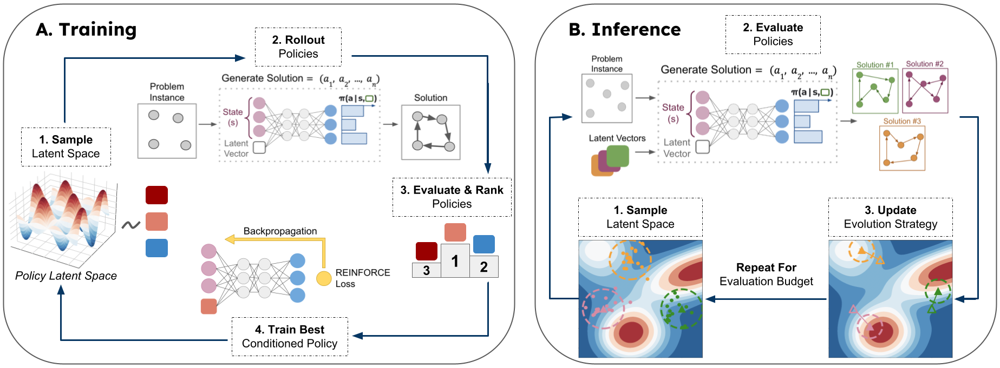

# 🧭 COMPASS : COMbinatorial optimization with Policy Adaptation using Latent Space Search

[](https://www.python.org)
[](https://github.com/google/jax)
[](LICENSE)
[](https://arxiv.org/abs/2311.13569)

<p align="center">
        
</p>

## Welcome to COMPASS! 👋
This repository contains the code for the paper Combinatorial Optimization with Policy Adaptation 
using Latent Space Search ([Chalumeau, Surana et al., 2023](https://arxiv.org/abs/2311.13569)), which was published at NeurIPS 2023.

Combinatorial Optimization (CO) has a wide range of real-world applications and we introduce
COMPASS as a general framework for solving CO problems. COMPASS learns a latent space of diverse
policies that can be explored at inference time in order to find the best-performing strategies for
a given instance. Practically, we use a single conditioned policy and sample the conditions from a 
continuous latent space which results in an infinite set of policies.

This codebase contains the implementation of COMPASS and three CO problems: traveling salesman 
problem (TSP), capacitated vehicle routing problem (CVRP), and jobshop scheduling problem (JSSP)
in JAX. We also provide the training and evaluation scripts for COMPASS, along with the necessary 
checkpoints and problem dataset files. 

NOTE: The results of EAS reported in the arXiv version is slightly different than the one reported in the
OpenReview version as we have improved the implementation to better match the original one
introduced in EAS (Hottung et al., 2022). Previously (in the OpenReview version), we backpropagated 
the gradients through the whole decoder to update the embeddings instead of backpropagating only 
through the last attention layer. This made the method significantly slower than expected. 
This codebase contains the improved implementation of EAS, and the arXiv version of the paper 
reports the results of EAS using this updated implementation.

## Code Overview 📁
The main folders and files are as follows:

- `compass`: contains the implementation of the CO problems, networks, and training procedure.
  - `/environments`: contains the implementation of the CO problems. 
  - `/networks`: contains the implementation of the networks.
  - `/trainers`: contains the training and validation procedures for COMPASS.
  - `/utils`: contains the utility functions.
- `data`: contains the problem datasets and checkpoints.
- `experiments`: contains the training and evaluation scripts for COMPASS.
- `statics`: contains the static files for the README.

Note: we also provide the implementation of [EAS](https://arxiv.org/pdf/2106.05126.pdf) in JAX, 
which is a baseline method for COMPASS. The implementation can be found in 
`compass/trainers/eas_emb.py`, and the script to run EAS can be found in `experiments/eas.py`.

## Reproducing the Results 📈

### Installation 🛠️
We recommend using docker to run the code. 
The docker image can be built using the following command, for TPU version:
```
make docker_build_tpu
```
or for local (GPU or CPU) version:
```
make docker_build_local
```

To start and enter docker container run the following commands:
```
make docker_start
make docker_enter
```

### Training 🏋️‍

To train COMPASS on a given problem, run the following command:
```
python experiments/train.py --config-name config_name.yaml
```
where `config_name` can be changed to
- `config_exp_tsp.yaml` for TSP
- `config_exp_cvrp.yaml` for CVRP 
- `config_exp_jssp.yaml` for JSSP.

These config files contain additional parameters, including COMPASS, problem-related and 
training-related hyperparameters. The default values are the ones used in the paper.

### Evaluation 📊
We provide two different evaluation scripts:

- `validate.py` which runs the evaluation of compass for the fast (small budget) setting.
- `slowrl_validate.py` which runs the full evaluation process for compass given the entire budget of rollouts.

To reproduce the TSP results reported in the paper for TSP problem size 100, run the following command:
```
python slowrl_validate.py --config-name config_exp_tsp.yaml slowrl.problems.load_problem=True slowrl.problems.load_path="data/validation/tsp100_test_seed1234.pkl" slowrl.problems.num_problems=10000 slowrl.environment.num_cities=100
```


## Citing COMPASS ✏️
If you use COMPASS in your work, please cite our paper:
```
@article{compass2023,
  title={Combinatorial Optimization with Policy Adaptation using Latent Space Search},
  author={Felix Chalumeau and Shikha Surana and Clément Bonnet and Nathan Grinsztajn and 
  Arnu Pretorius and Alexandre Laterre and Thomas D. Barrett},
  booktitle={Advances in Neural Information Processing Systems},
  year={2023}
}
```

## Acknowledgements 🙏

This research was supported with Cloud TPUs
from Google's [TPU Research Cloud](https://sites.research.google/trc/about/) (TRC) 🌤.


## Contributors 🤝

<a href="https://github.com/felixchalumeau" title="Felix Chalumeau"></a>
<a href="https://github.com/surana01" title="Shikha Surana"></a>
<a href="https://github.com/nathangrinsztajn" title="Nathan Grinsztajn"></a>
<a href="https://github.com/clement-bonnet" title="Clément Bonnet"></a>
<a href="https://github.com/arnupretorius" title="Arnu Pretorius"></a>
<a href="https://github.com/alaterre" title="Alex Laterre"></a>
<a href="https://github.com/tomdbar" title="Thomas D. Barrett"></a>
